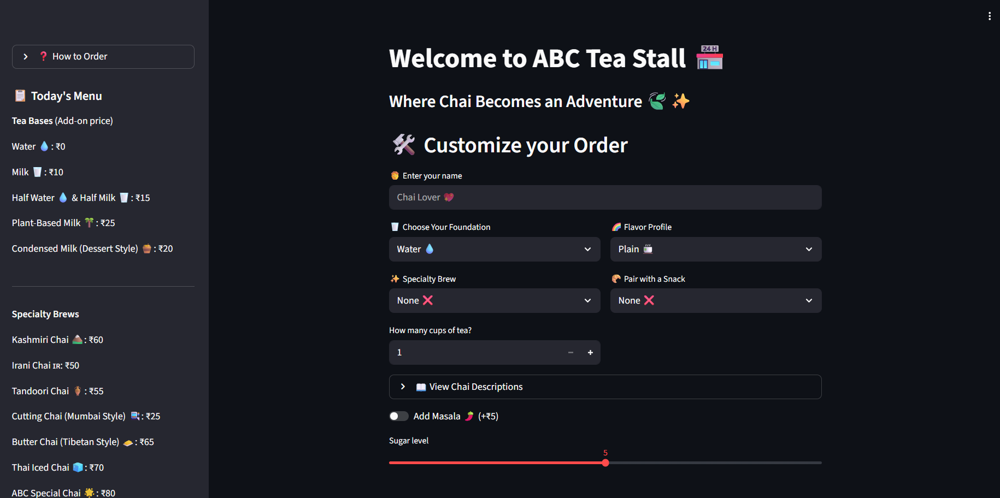

# ☕ ABC Tea Stall - Streamlit App

Welcome to the **ABC Tea Stall**, a premium digital chai experience where tradition meets technology. This interactive Streamlit application allows users to customize their perfect brew, pair it with classic snacks, and visualize their order process in real-time.



## 🌟 Features

* **Dynamic Customization:** Choose your milk base, tea specialty, and flavor profiles.
* **Live Pricing:** Watch your total bill update instantly as you add masala or extra cups.
* **Interactive Menu:** A dedicated sidebar for price browsing and "Chai Stories" to learn about regional brews.
* **Real-time Brewing Simulation:** A visual status bar that mimics the tea-making process.
* **Digital Receipts:** Generates a clean, summarized receipt upon order confirmation.


---

### 📋 Menu Highlights
- The ABC Special: Our 2026 signature blend featuring 7 spices and gold-grade tea.
- Kashmiri Chai: A beautiful pink, salty-sweet traditional experience.
- Snack Pairings: From classic Bun Maska to spicy Cheese Chilli Toast.


## 🛠️ Tech Stack

* **Python 3.x**
* **Streamlit** (Web Framework)
* **Time** (For brewing simulations)


## 📂 Project Structure

abc_tea_stall

├── app.py     
├── README.md  
├── requirements.txt
└── output.png


## 🚀 Getting Started

### Prerequisites

Make sure you have Python installed on your system. You will also need the `streamlit` library.

---

### Installation

1. **Clone this repository** (or save the script as `app.py`):
   ```bash
   git clone https://github.com/akramraza007/abc_tea_stall.git
   cd abc_tea_stall
    ```
2. Install dependencies  
   ```bash
    pip install requirement.txt
    ```

3. Run the application
    ```bash
    streamlit run app.py
    ```

4. Open the browser link shown in the terminal.


## 📝 How to Use
1. **Identify Yourself:** Enter your name for a personalized receipt (or remain an anonymous Chai Lover).
2. **Build Your Base:** Select your milk preference and flavor profile (like Adrak or Kesar).
3. **Explore the Menu:** Choose a specialty tea; use the **"View Chai Descriptions"** expander to see the history of your brew.
4. **Fine-tune:** Toggle the Masala option, set your sweetness level, and pick your quantity.
5. **Brew & Enjoy:** Hit **Confirm Order** to trigger the real-time brewing simulation and receive your digital receipt!
